# 🏗️ AceIt System Architecture

AceIt is a high-performance, real-time AI interviewer that optimizes for **"Response-First"** interactions. It leverages a low-latency streaming pipeline and a biometric feedback loop to simulate a high-stakes technical interview environment.

## 🛠️ Technology Stack

### Frontend (Next.js 15 Core)
- **Framework**: Next.js (App Router) with TypeScript.
- **State Management**: **Zustand** (Store for session metadata, metrics, and interview state).
- **Communication**: 
  - **Server-Sent Events (SSE)** for AI token streaming.
  - **WebRTC (`aiortc`)** for real-time video/audio processing and data channels.
  - **Fetch/JSON** for session initialization and RAG uploads.
- **UI/UX**: Vanilla CSS for high-performance cyberpunk styling, **TalkingHead** for real-time 3D AI avatar rendering with lip-sync.

### Backend (Python `aiohttp` Core)
- **Framework**: `aiohttp` (Asynchronous HTTP/WS server).
- **Real-Time Pipeline**: `aiortc` for handling incoming WebRTC media tracks and landmarks.
- **Inference & Analysis**:
  - **MediaPipe**: Web-based landmark extraction (30 FPS).
  - **PyTorch**: Custom `VisualConfidenceModel` for biometric physical scoring.
  - **Pyodide**: Client-side Python compilation and execution environment for technical interviews.
  - **Whisper**: High-accuracy Speech-to-Text transcription.
- **LLM Engine**: **Google Gemini (Flash 3.0 & Pro 2.5)** for real-time reasoning and final report generation.

### Infrastructure & Persistence
- **Database**: **Supabase (PostgreSQL)** for session metadata, biometric keyframes, and transcripts.
- **Authentication**: **Clerk** (Integrated with Supabase RLS).

---

## 🔄 End-to-End Data Flow

```mermaid
sequenceDiagram
    participant User as 👤 Candidate
    participant FE as 💻 Next.js Frontend
    participant BE as ⚙️ aiohttp Backend
    participant Gemini as 🧠 Google Gemini API
    participant DB as 🗄️ Supabase (Postgres)

    User->>FE: Uploads Resume & JD
    FE->>BE: /api/init-session (RAG Context)
    BE->>DB: Store Session Metadata
    BE-->>FE: Return SessionID

    Note over FE,BE: WebRTC Handshake (DataChannel + Audio)
    
    loop Real-time Biometrics
        FE->>BE: Landmarks via DataChannel
        BE->>BE: Process Gaze & Fidget metrics
        BE-->>FE: DataChannel: Real-time HUD Update
    end

    User->>FE: Answers Question (Audio)
    FE->>BE: Audio Track (aiortc)
    BE->>BE: Whisper Transcription
    BE->>Gemini: Stream Prompt Context
    Gemini-->>BE: SSE Token Stream
    BE-->>FE: SSE Token Stream
    FE->>FE: Avatar LipSync + TTS playback
    
    Note over BE,DB: Background: Async Keyframe Logging
    BE->>DB: upsert interview_keyframes (Biometrics + Transcript)

    User->>FE: End Interview
    BE->>Gemini: Generate Final Coaching Report
    BE->>DB: Save interview_reports
```

---

## 💎 Core Architectural Components

### 1. The "Response-First" Pipeline
To eliminate conversational "uncanny valley" lag, we prioritize response delivery:
- **Streaming Tokens**: Gemini Flash 3.0 tokens are streamed directly to the frontend via SSE.
- **Parallel Synthesis**: TTS (ElevenLabs) and Avatar animation (TalkingHead) begin as soon as the first sentence is received.
- **Fire-and-Forget Logging**: Intensive database writes are pushed to `asyncio.create_task`, ensuring they never block the critical interview loop.

### 2. Biometric Feedback Loop
Unlike standard chatbots, AceIt analyzes the user's physical presence:
- **Gaze Stability**: Detects eye-tracking metrics to identify script-reading or lack of confidence.
- **Fidget Index**: Measures hand/body movement variance (standard deviation of landmarks).

### 3. Specialized Interview Tracks
- **System Design Track**: The backend selects "Architect" personas (e.g., SearchCo Architect) that challenge candidates on distributed systems, Big-O scaling, and trade-offs.
- **Technical Coding Track**: Integrated **Python Compiler** (Pyodide) allows real-time implementation and execution. The AI interviewer analyzes code structure, variable naming, and logic flow as the user types.
- **Adaptive Persona**: The backend adjusts the interviewer's tone (Strict vs. Encouraging) based on the user's real-time physical indicators.

### 4. Contextual RAG (Resume-Aware)
The system uses the uploaded documents to ground the LLM, ensuring that technical questions are relevant to the candidate's actual experience level and the job's specific requirements.

---

## 📊 Data Mapping (Supabase Schema)

| Table | Purpose | Key Fields |
| :--- | :--- | :--- |
| `interview_metadata` | Session Config | `resume_text`, `job_description`, `session_id`, `overall_score` |
| `interview_keyframes` | Real-time Logs | `timestamp`, `interviewer_question`, `user_transcript`, `biometrics_json` |
| `interview_reports` | Coaching Output | `markdown_report`, `competency_scores`, `actionable_feedback` |

---

## 🔒 Security & Privacy
- **In-Memory Processing**: Media streams (Video/Audio) are processed frame-by-frame and never stored as raw files.
- **Distilled Storage**: Only anonymous biometric metrics and transcripts are persisted.
- **RLS (Row-Level Security)**: Clerk JWTs ensure that candidates can only access their own performance data.
