# 🏗️ AceIt System Architecture

AceIt is a high-performance, real-time AI interviewer that optimizes for "Response-First" interactions. It leverages low-latency streaming and biometric feedback loop to simulate a high-stakes technical interview environment.

## 🛠️ Technology Stack

### Frontend (Next.js 15+ Core)
- **Framework**: Next.js (App Router) with TypeScript.
- **State Management**: **Zustand** (Persistent middleware for session continuity).
- **Communication**: 
  - **Server-Sent Events (SSE)** for AI token streaming.
  - **WebRTC (aiortc)** for real-time video/audio processing.
  - **Fetch/JSON** for metadata and session management.
- **UI/UX**: Vanilla CSS for precision styling, **TalkingHead** for GLB-based AI avatar rendering.

### Backend (Python aiohttp Core)
- **Framework**: `aiohttp` (Asynchronous HTTP/WS server).
- **Real-Time Pipeline**: `aiortc` for handling incoming WebRTC media tracks.
- **Inference Models**:
  - **MediaPipe**: Real-time facial landmark and hand tracking.
  - **PyTorch**: Custom `VisualConfidenceModel` and `AudioConfidenceModel` for biometric scoring.
  - **OpenAI Whisper**: Speech-to-Text (STT) transcription.
- **LLM Engine**: **Google Gemini (Flash 3.0 & Pro 2.5)** via `google-genai` SDK.

### Infrastructure & Persistence
- **Database**: **Supabase (PostgreSQL)** via REST wrapper.
- **Storage**: Sessions, Keyframes (Biometrics + Transcripts), and Final Coaching Reports.
- **Authentication**: Clerk (Integrated with Supabase RLS).

---

## 🔄 End-to-End Data Flow

```mermaid
sequenceDiagram
    participant User as 👤 Candidate
    participant FE as 💻 Next.js Frontend
    participant BE as ⚙️ aiohttp Backend
    participant Gemini as 🧠 Google Gemini API
    participant DB as 🗄️ Supabase (Postgres)

    User->>FE: Uploads Resume & JD
    FE->>BE: /init-session (Resume + JD)
    BE->>DB: Save Session Metadata
    BE-->>FE: Stream SessionID

    Note over FE,BE: WebRTC Handshake Starts
    FE->>BE: WebRTC Track (Video/Audio)
    
    loop Real-time Biometrics
        BE->>BE: MediaPipe Landmark Extraction
        BE->>BE: PyTorch Stress/Confidence Scoring
        BE-->>FE: DataChannel: Biometric JSON
    end

    User->>FE: Records Technical Answer
    FE->>BE: /chat (Audio Segment + Biometrics)
    BE->>BE: Whisper Transcription
    BE->>Gemini: Adaptive Prompt Generation
    Gemini-->>BE: SSE Token Stream
    BE-->>FE: SSE Token Stream
    FE->>FE: Avatar LipSync + TTS playback

    Note over BE,DB: Background Task: Analysis Consolidations
    BE->>Gemini: Generate Final Coaching Report
    BE->>DB: Save Report Markdown
```

---

## 💎 Core Architecture Components

### 1. The "Response-First" Pipeline
To eliminate latency, we decouple the AI response from the background processing:
- **Streaming Init**: The session ID is sent to the frontend *immediately* before the AI even starts thinking.
- **SSE Token Streaming**: Tokens are streamed to the UI as they are generated by Gemini Flash 3.0, allowing the avatar to start speaking within 400-800ms.
- **Detached Analysis**: Intensive tasks like Supabase logging and final report generation are pushed to `asyncio.create_task`, ensuring they never block the active interview stream.

### 2. Biometric Feedback Loop (Real-time WebRTC)
Unlike standard AI chats, AceIt analyzes the user's *physical* state:
- **Gaze Detection**: Monitors eye movements to detect nervousness or reading from scripts.
- **Fidget Index**: Extracts hand movement variance (standard deviation of landmarks).
- **Pressure Score**: A "Chess Engine" style algorithm that adjusts the interviewer's persona (Strict, Skeptical, Relentless) based on real-time stress levels.

### 3. Adaptive Persona Engine
The backend constructs dynamic system prompts by layering:
- **Base Persona**: (e.g., "The Skeptical Senior Engineer").
- **Difficulty Tier**: Mapped to the current `pressure_score`.
- **Trend Modifier**: Adapts tone based on whether the candidate's performance is `rising` (harder) or `falling` (re-building confidence).

---

## 📊 Data Mapping (Supabase)

| Table | Purpose | Key Fields |
| :--- | :--- | :--- |
| `interview_metadata` | Session Config | `resume_text`, `job_description`, `overall_score` |
| `interview_keyframes` | Chronological Log | `timestamp`, `interviewer_question`, `associated_transcript`, `confidence_score` |
| `interview_reports` | Final Output | `markdown_report`, `session_id`, `created_at` |

---

## 🔒 Security & Privacy
- **Processing**: Video and audio are processed frame-by-frame in memory on the backend and never persisted to raw video files.
- **Storage**: Only distilled metrics (keyframes) and the final transcript are stored in the encrypted Supabase database.
- **RLS**: Supabase Row-Level Security ensures candidates can only view their own performance reports.
